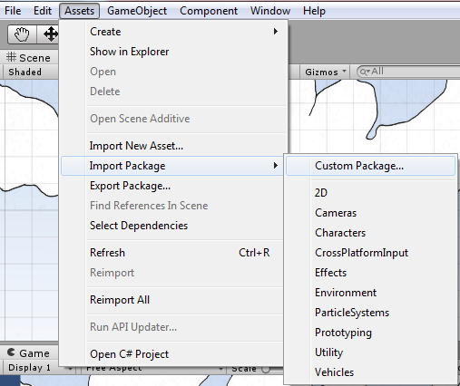
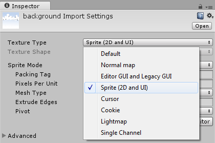
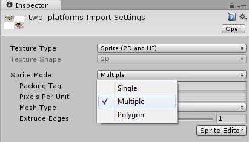
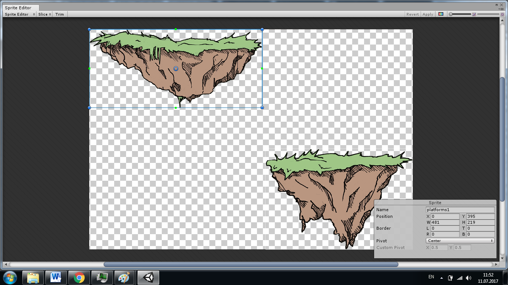
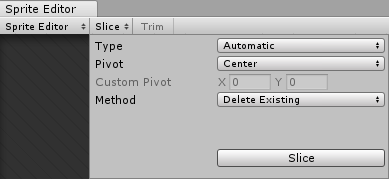
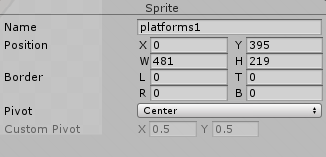
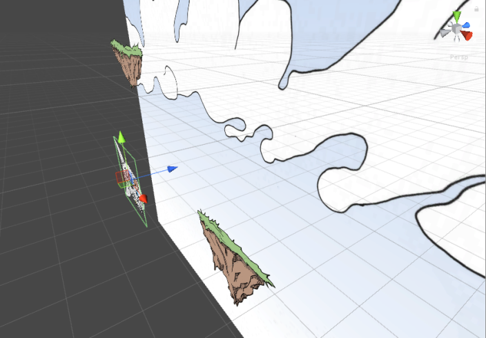
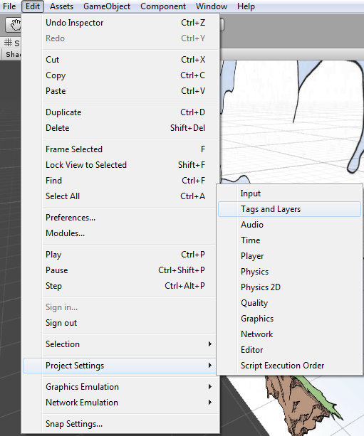
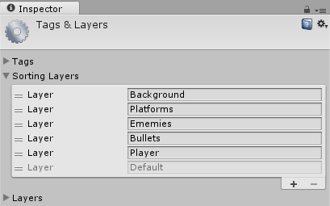
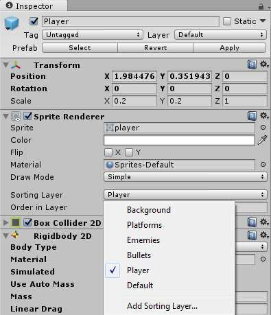

### Импортирование и настройка изображений

Важным элементом 2D игр являются картинки персонажей, элементы фона, различные игровые объекты, которые загружаются как текстуры в Unity. Для того чтобы загрузить картинку нужно нажать в меню `Asset -> Import Package -> Custom Package` и выбрать нужные файлы

Но это всего лишь текстура. В Unity объекты, которые участвуют в 2D играх, называются спрайтами (Sprite). Нам необходимо преобразовать картинки в этот тип объектов. Для этого нужно найти картинку в панели Project, выбрать ее и в уже в панели Inspector изменить `Texture Type` на `Sprites (2D and UI)`

Для экономии размеров несколько картинок объединяют в одну, а уже в Unity мы можем их разделить. Для того чтобы разделить картинки, необходимо выбрать картинку в панели Project, далее в панели Inspector изменить параметр `Sprite Mode` на `Multiple` (Single значит что это одна картинка, а Multiple что несколько картинок на одной) и нажать Sprite Editor.

Тогда откроется окно настройки картинок. Здесь можно выделять самостоятельно картинки и давать им названия

Это немного трудоемко, поэтому способ сделать это быстро. Нужно в верху найти Slice и нажать Slice. Произойдет автоматическое разделение картинок на спрайты

Остается только дать им название. Для это нажимаем на объект и внизу появляется панель где в параметре Name пишем имя объекта которое будет у него в игре.

После можно закрыть Sprite Editor

Теперь, когда мы загрузили объекты, преобразовали и разделили, можно переносить их на сцену

### Задаем порядок наложения слоев

После того как мы перенесли объекты на сцену, нам нужно выстроить их порядок, так как может получить что одни спрайты впереди всех а другие сзади, и даже что персонаж будет находиться за фоном, что не правильно. Это можно сделать 2 путями:

- Изменением дистанции объекта от камеры. Что изменить расстояние необходимо после выбора объекта в панели Hierarchy, найти в панели `Inspector -> Position` и изменить координату Z, так как она определяет дальность объекта от камеры. Чем больше значение Z, тем дальше будет объект от камеры

  
- Второй путь это применение параметра Sorting Layer. Он отвечает за порядок визуализации объектов на сцене

  

### Настраиваем Sorting Layers

Для того чтобы настроить Sorting Layer нужно в меню найти `Edit -> Project Setting -> Tags and Layers` 

Далее уже в панели Inspector создать необходимые слои через +, дать им название и выстроить их правильный порядок. Нижний слой будет рисоваться первым вверх по порядку. К примеру вот так

После этого для всех объектов, которые у нас находятся на Scene нужно в панели Inspector указать их Sorting Layer.

Если у вас несколько объектов относятся к одному слою, то и здесь нужно указать их порядок. Для этого под Sorting Layer есть параметр Order in Layer, где мы указываем число. Чем больше число, тем раньше будет визуализироваться объект внутри своего слоя. 