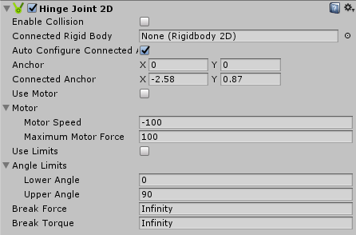
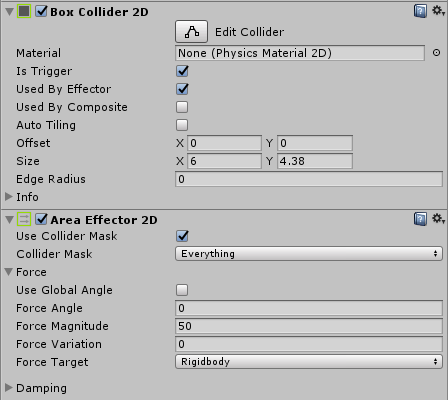
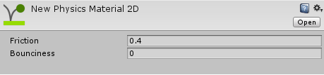
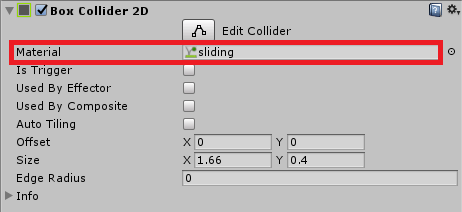
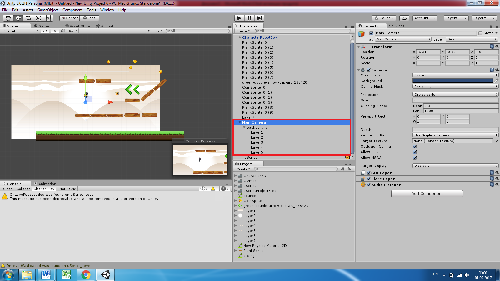
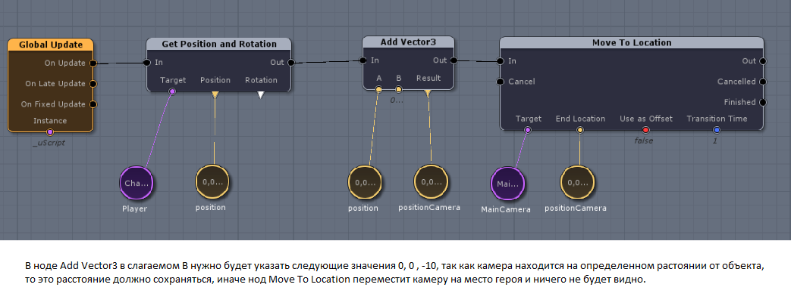

### Hinge Joint 2D

Hinge Joint 2D, это тот же Hinge Joint что и был в первой части. Он позволяет объекты вращаться. Поэтому разобраться в нем не будет сложно. С помощью него можно будет создать вращающиеся платформы и еще кое-что интересное

Большинство настроек здесь те же, что и в 3D:

- Enable Collision – учитывает коллайдеры других объектов, т е сталкивается с ними.
- Connected Rigid Body – прикрепляет объект к другому объекту.
- Connected Anchor и Anchor – точка привязки и точка вращения объекта.
- Use Motor – Заставляет вращаться объект. Motor speed – скорость вращения объекта(+ по часовой, - вращение против часовой стрелки) Maximum Motor Force – сила сопротивления другим объектам(например если на нее прыгнет герой, то она под силой тяжести не будет крутиться, если стоит маленькое значение)
- Use Limits – ограничение по вращению объекта.

### Area Effector 2D

Данный компонент позволяет создавать области силы, под действием которых наш герой будет двигаться в определенную сторону. Например, вентиляторы, которые подбрасывают героя, или наоборот магниты, которые притягивают. Работают исключительно в области коллайдера.

Для работы данного компонента, необходимо в коллайдере указать, что это триггер (Is Trigger) и что используются под данный компонент (Used By Effector).

Настройки этого компонента:

- Use Collider Mask – позволяет настроить влияние эффекта на определенные объекты, за счет слоев (Layer).
- Collider Mask – здесь выбираем какие слови нужно влиять если на слое стоит галочка значит эффектор будет на него работать. Everything указывает на то что на все объекты будет работать эффектор у которых есть Rigid Body 2D и коллайдер.
- Use Global Angle – использование глобальной переменной угла (желательно включить, легче настроить направление силы)
- Force angle – направление куда будет влиять сила в градусах ( 0 – вправо, 90 – вверх, 180 – влево, 270 – вниз).
- Force Magnitude – максимальная сила влияния.
- Force Variation – случайная сила, чем больше тем сильнее рандом от максимальной силы.
- Damping – сопротивление, 
- Drag – сопротивление перемещению объекта.
- Angular Drag – сопротивление вращению объекта.

### Bouncing and Sliding

Можно создать прыгучие платформы, или скользкие. Для этого необходимо создавать Physics Material 2D (ПКМ на Project -> Create -> Physics Material 2D).

- Friction – трение, если поставить на 0, то получится скольжение по платформе
- Bounciness – прыгучесть, значение от 0 до 1, это соответствие 0-100% силы прыжка. Если поставить больше 1, тогда объект отскочит сильнее, чем до этого прыгнул.

Данный материал необходимо добавлять в компоненте коллайдер того объекта, поверхность которого должна быть скользкой или прыгучей, в область Material, как например материал скольжения, чтобы платформа была скользкой.

### Настройка фона

Для настройки заднего фона есть несколько картинок, из которых и
складывается задний фон

1. Необходимо создать пустышку, назовем ее Background
2. Переместить туда картинки по порядку в соответствии с номером
3. Background переместить в камеру. Таким образом, задний фон всегда будет виден. Это подойдет для платформенной игры

Скрипт для управления камерой выглядит так

